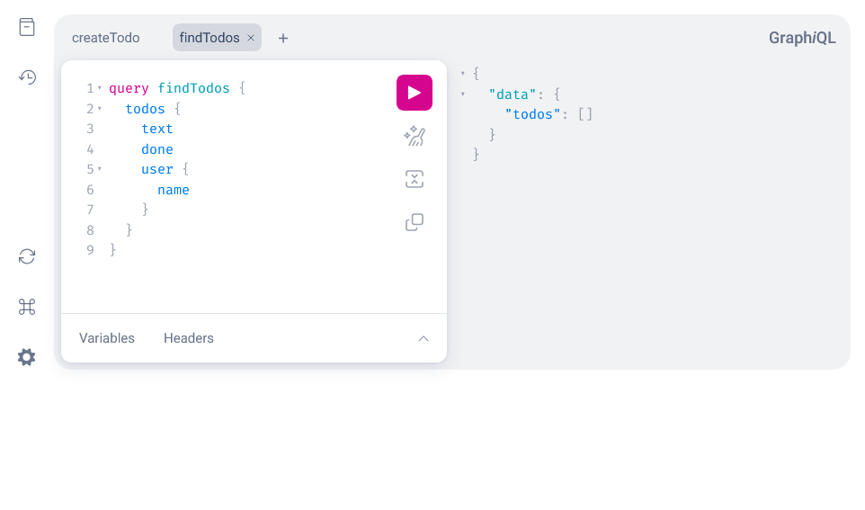
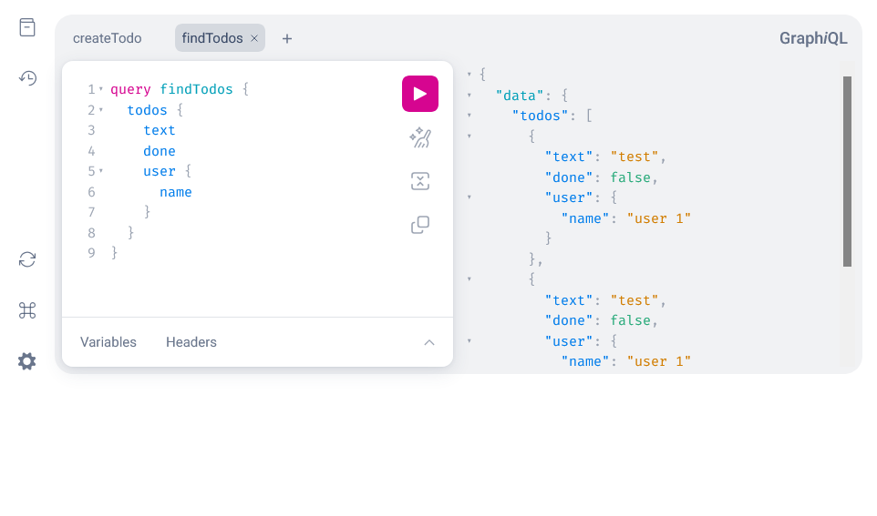

https://gqlgen.com/getting-started/

```bash
go mod init github.com/blank71/gqlgen-learn
```

```bash
cat << '_EOF_' > ./tools.go
//go:build tools

package tools

import (
	_ "github.com/99designs/gqlgen"
)
_EOF_
```

```bash
go mod tidy
go install github.com/99designs/gqlgen@latest
gqlgen init
```

テンプレートを作成したので、リクエストに対して応答するコードとして resolver を書く。
https://github.com/blank71/gqlgen-learn/commit/69216fb7c9aedcc3f2fc6fde28ca14b039e3e196

下記で GraphQL サーバーを起動する。

```bash
go run server.go 
```

下記から mutatuin を叩いたり、query を投げることができる。



```graphql
mutation createTodo {
  createTodo(input: { text: "todo", userId: "1" }) {
    user {
      id
    }
    text
    done
  }
}
```
```graphql
query findTodos {
  todos {
    text
    done
    user {
      name
    }
  }
}
```

createTodo を 2 回実行して findTodos を実行すると下記の内容を得ることができる。



```json
{
  "data": {
    "todos": [
      {
        "text": "test",
        "done": false,
        "user": {
          "name": "user 1"
        }
      },
      {
        "text": "test",
        "done": false,
        "user": {
          "name": "user 1"
        }
      }
    ]
  }
}
```

下記のようにすると todo の id がランダムになっている。

```graphql
query findTodos {
  todos {
    id
    text
    done
    user {
      id
      name
    }
  }
}
```

下記が得られる。

```json
{
  "data": {
    "todos": [
      {
        "id": "T38",
        "text": "test",
        "done": false,
        "user": {
          "id": "1",
          "name": "user 1"
        }
      },
      {
        "id": "T64",
        "text": "test",
        "done": false,
        "user": {
          "id": "1",
          "name": "user 1"
        }
      }
    ]
  }
}
```

> This example is great, but in the real world fetching most objects is expensive. We don’t want to load the User on the todo unless the user actually asked for it. So lets replace the generated Todo model with something slightly more realistic.
> https://gqlgen.com/getting-started/#dont-eagerly-fetch-the-user
>
> この例は良いが、運用上では多くのオブジェクトを取得するのは高価になる。todo の user の情報は必要になるまで読み込みたくはない。生成される Todo モデルを変更して、実情に合わせてみる。

autobind を有効にすることで gqlgen がカスタムモデルを使用することができる。
`gqlgen.yml` で下記のように定義する。

```yml
autobind:
  - "github.com/blank71/gqlgen-learn/graph/model"
```

`gqlgen.yml` でモデルに Todo の定義をする。

```
models:
  Todo:
    fields:
      user:
        resolver: true
```

`graph/model/todo.go` を定義して `gqlgen generate` する。

```bash
cat << '_EOF_' > ./graph/model/todo.go
package model

type Todo struct {
	ID     string `json:"id"`
	Text   string `json:"text"`
	Done   bool   `json:"done"`
	UserID string `json:"userId"`
	User   *User  `json:"user"`
}
_EOF_
```
